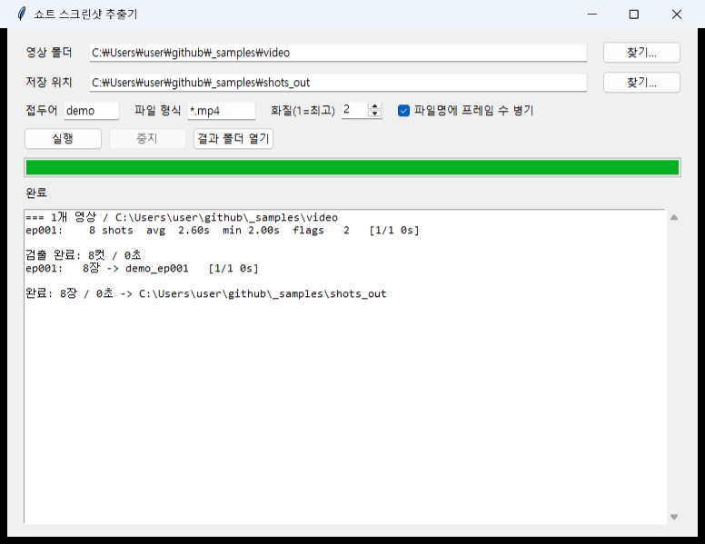
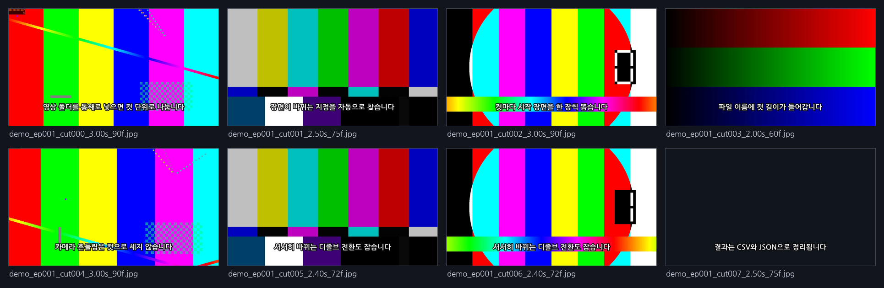
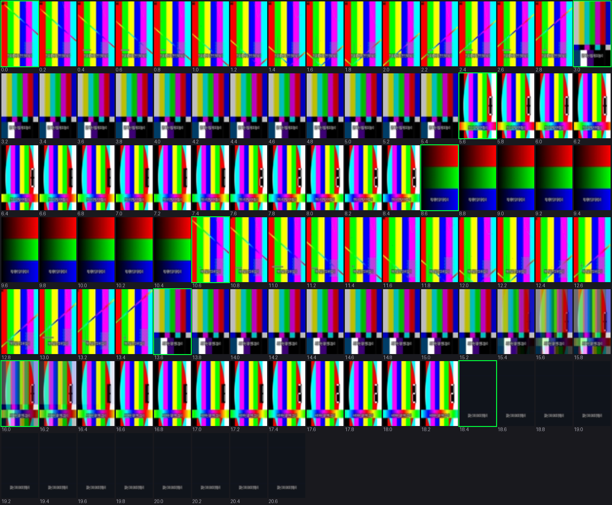

# shot-detect

`shot-detect`는 영상 폴더를 입력받아 각 영상을 쇼트(컷) 단위로 분할하고, 쇼트마다 시작 장면을 스크린샷으로 추출합니다.
추출된 스크린샷 파일명에는 해당 쇼트의 길이가 포함됩니다. 예: `na_ep001_cut007_2.4s.jpg`

> Batch shot-boundary detection for video folders. Splits every video into shots and exports one
> screenshot per shot, with the shot duration baked into the filename. Pure ffmpeg + numpy, no ML
> model, no GPU. Ships with a QC tool because shot detection is never 100% and you need to see
> what it got wrong.

**다운로드** — [v1.0.0 실행 파일](https://github.com/97hhg1114-del/shot-detect/releases/latest) (184MB, 파이썬·ffmpeg 설치 불필요)



## 활용 사례

이 도구는 숏폼 드라마 50화와 같이 대량의 영상을 컷 단위로 분할하고 각 컷의 시작 장면을 추출해야 하는 상황을 염두에 두고 개발되었습니다.
사람이 수동으로 작업할 경우 한 화당 40~60컷, 50화 기준 2,000컷 이상을 타임라인에서 일일이 찾아야 하므로 많은 시간이 소요됩니다.

주요 활용 사례는 다음과 같습니다.

-   **편집 참고용 컷 리스트**: 레퍼런스 영상의 컷 길이와 호흡을 파악하여 편집에 참고합니다.
-   **스토리보드 역설계**: 완성된 영상에서 컷 구성을 추출하여 콘티로 되돌립니다.
-   **썸네일·클립 후보 선정**: 쇼트 시작 프레임은 대체로 구도가 잘 정리된 프레임이므로 썸네일이나 클립 후보로 활용하기 좋습니다.
-   **자막·더빙 작업 전 컷 분해**: 컷 번호와 시작 시간이 CSV 형식으로 제공되어 작업에 활용할 수 있습니다.

파일명에 컷 길이가 포함되어 있어, 탐색기에서 파일명만 확인해도 영상의 리듬을 직관적으로 파악할 수 있습니다.

## 필수 구성 요소

-   `ffmpeg`, `ffprobe` (PATH 환경 변수에 등록되어 있어야 합니다)
-   Python 3 + `numpy`, `Pillow` 라이브러리

```bash
pip install numpy pillow
```

빌드된 `.exe` 파일을 사용하면 위 구성 요소가 필요 없습니다 (아래 "exe로 빌드" 섹션 참고).

## GUI 사용법

`shot-detect.exe` 파일을 더블클릭하여 실행합니다. 영상 폴더, 저장 위치, 접두어를 지정한 후 실행 버튼을 누릅니다.
진행률 바와 로그가 표시되며, 중지 버튼을 누르면 현재 처리 중인 영상까지만 완료하고 멈춥니다.

`.exe` 파일에 인자를 전달하면 아래 CLI와 동일하게 동작합니다. 다만 창 없는 빌드이므로 표준 출력은 없으며,
로그는 `%TEMP%\shotcut_cli.log` 파일에 기록됩니다.

## CLI 사용법

```bash
# 기본 사용법: 영상 폴더 안에 에피소드별 폴더를 생성하고 스크린샷 저장
python shotcut.py "D:\작업\어떤시리즈\영상"

# 접두어를 붙이고 다른 위치에 저장
python shotcut.py "...\영상" -o "...\스크린샷" -p na

# 검출만 먼저 수행 (shots.json만 생성) → QC 확인 → 마음에 들면 추출
python shotcut.py "...\영상" --detect-only
python shotcut.py "...\영상" --extract-only

# 특정 에피소드만 처리
python shotcut.py "...\영상" --only ep001 ep004
```

주요 옵션: `-g/--glob` (기본 `*.mp4`), `-q/--quality` (ffmpeg `-q:v` 옵션, 기본 2 = 최고 화질),
`--frames-in-name` (duration을 `_2.34s_56f` 형식으로 — 초와 실제 프레임 수 병기)

**결과물**

-   `<prefix>_<epid>/` 폴더별 스크린샷 — 예: `na_ep001_cut000_5.0s.jpg`
-   `shot_list.csv` — 에피소드/컷 번호/시작 초/duration/프레임 번호 통합 목록
-   `shots.json` — 검출 결과 캐시 (QC 및 재추출용)



*샘플 영상을 넣고 뽑은 결과. 컷 길이가 파일명에 들어가고, 흔들림 구간은 한 컷으로 유지되며 디졸브 구간은 두 컷으로 나뉜 것을 볼 수 있습니다.*

에피소드 ID는 파일명에서 `ep\d+` 패턴을 찾아 사용합니다. 해당 패턴이 없으면 파일명 전체를 에피소드 ID로 사용합니다.

## QC (품질 관리)

**작업 완료 후에는 반드시 육안으로 결과를 확인해야 합니다.** 컨택트시트는 검출 정확도를 확인하는 유일한 방법입니다.

```bash
# 전체 흐름 훑기 — 초록 테두리는 검출된 쇼트 시작을 의미합니다
python qc.py sheet "...\ep001.mp4" --step 8 --page 0

# 의심 구간을 프레임 단위로 확대 (58초~62초)
python qc.py zoom "...\ep001.mp4" 58 62 --step 1

# 의심 쇼트만 필름스트립으로 확인 — 한 줄에 다른 장면이 섞여 있으면 컷을 놓친 것입니다
python qc.py flags "...\ep001.mp4" --kind drift
```



`flags` 종류: `drift`(쇼트 앞뒤가 많이 다름 = 놓친 컷 의심), `spike`(쇼트 내부에 큰 변화),
`short`(너무 짧음 = 오검출 의심), `all`. 대부분의 경우 움직임이 큰 쇼트이므로 정상입니다. 이는 검토 대기열이지 에러 목록이 아닙니다.

## 검출 방식

`shotlib.py`는 ffmpeg을 사용하여 48x85로 축소된 프레임을 통째로 읽어 7단계로 쇼트를 판정합니다.

1.  인접 프레임의 평균 절대차를 계산합니다.
2.  **적응형 임계값**: 전역 임계값이 아닌 주변 프레임 중앙값 대비 비율로 판정합니다. 이를 통해 같은 방 안의 쇼트/리버스 쇼트처럼 화면이 비슷한 컷도 감지할 수 있습니다.
3.  **지속성 검증**: 바뀐 화면이 일정 시간 이상 유지되어야 컷으로 인정합니다. 이는 카메라 흔들림으로 인한 오검출을 제거합니다.
4.  **플래시 제거**: 화면이 하얗게 터지는 연출을 두 개의 컷으로 오인하지 않도록 방지합니다.
5.  **모션 감쇠 제거**: 컷 직후 빠른 움직임이 추가 컷으로 잘못 감지되는 것을 방지합니다.
6.  **최소 길이**: 4프레임 미만의 파편적인 컷들을 흡수합니다.
7.  **디졸브 검출**: 프레임 간 차이가 크게 튀지 않는 크로스 디졸브를 감지합니다. 전환 구간을 사이에 두고 앞뒤 블록의 평균을 비교하며, 빠른 카메라 무빙과 구분하기 위해 블록 내부 움직임보다 블록 간 차이가 3배 이상 클 때만 디졸브로 인정합니다.

스크린샷은 쇼트 시작에서 몇 프레임 뒤를 기준으로 추출합니다 (모션 블러, 디졸브 잔상을 회피).
플래시로 인해 하얗게 날아간 프레임은 자동으로 피하고 다른 프레임을 선택합니다.

## exe 파일 빌드

```bash
python build.py             # 단일 exe 파일 생성 → 바탕화면 (약 196MB)
python build.py --onedir    # 폴더 형태로 빌드. 기동 즉시 실행되며, 압축 해제 과정이 없습니다
```

`build.py`는 ffmpeg/ffprobe를 PATH에서 찾아 번들 내 `bin/` 폴더에 포함시키고, `gui.py`는 시작 시 해당 경로를 PATH 앞에 추가합니다. 따라서 빌드된 `.exe` 파일을 사용하는 PC에는 Python이나 ffmpeg이 설치되어 있지 않아도 됩니다.
아이콘은 `make_icon.py`가 생성합니다 (`app.ico`, 파일이 없으면 `build.py`가 자동 실행).

onefile 빌드는 실행할 때마다 196MB를 임시 폴더에 압축 해제하므로 기동에 약 3초가 소요됩니다.
자주 실행하는 경우 `--onedir` 옵션을 사용하는 것이 더 쾌적합니다.

`shotlib.NOWIN`은 창 없는 빌드에서 ffmpeg 호출 시 콘솔 창이 깜빡이는 것을 방지하는 플래그입니다.
CLI로 사용해도 무해합니다.

## 다른 영상 소재에 적용 시

임계값은 `shotlib.py` 상단에 상수로 정의되어 있습니다. 현재 값은 24fps 세로 숏폼 드라마 기준으로 설정되어 있습니다.
사용하는 영상 소재가 다른 경우 다음 세 가지 상수를 먼저 조정해 보십시오.

| 상수 | 역할 | 증상 |
|---|---|---|
| `HARD_DELTA` | 하드컷 감도 | 낮추면 컷을 더 많이 감지함 (오검출 증가) |
| `DIS_MIN` | 디졸브 감도 | 낮추면 디졸브를 더 많이 감지함 (카메라 무빙 오검출 증가) |
| `FLASH_SIM` | 플래시 관용도 | 높이면 플래시를 더 많이 흡수함 (실제 컷을 놓칠 위험 증가) |

임계값을 변경한 후에는 반드시 `qc.py`를 사용하여 결과를 재확인하십시오.

## 실전 기록

세로 숏폼 드라마 50화(약 24fps)에 이 도구를 적용하여 2,312컷을 추출했으며, 컨택트시트를 통해 전량 육안 검증을 완료했습니다.
위 임계값은 해당 검증 과정에서 최적화된 값입니다.

## 라이선스

MIT
